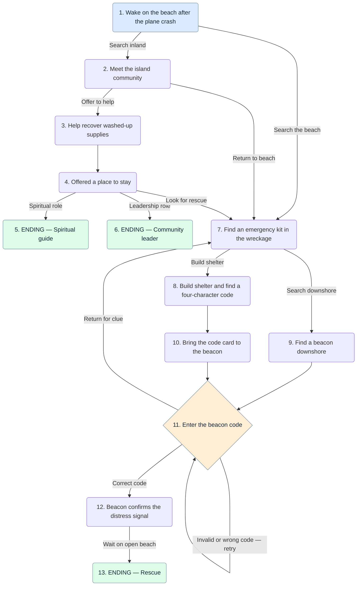

Team Members and Roles:  

Application Overview: 

## Story Flowchart

```mermaid
flowchart TD
    N1("1. Wake on the beach after the plane crash")
    N2("2. Meet the island community")
    N3("3. Help recover washed-up supplies")
    N4("4. Offered a place to stay")
    N5("5. ENDING — Spiritual guide")
    N6("6. ENDING — Community leader")
    N7("7. Find an emergency kit in the wreckage")
    N8("8. Build shelter and find a four-character code")
    N9("9. Find a beacon downshore")
    N10("10. Bring the code card to the beacon")
    N11{"11. Enter the beacon code"}
    N12("12. Beacon confirms the distress signal")
    N13("13. ENDING — Rescue")

    N1 -->|Search inland| N2
    N1 -->|Search the beach| N7
    N2 -->|Offer to help| N3
    N2 -->|Return to beach| N7
    N3 --> N4
    N4 -->|Spiritual role| N5
    N4 -->|Leadership role| N6
    N4 -->|Look for rescue| N7
    N7 -->|Build shelter| N8
    N7 -->|Search downshore| N9
    N8 --> N10
    N9 --> N11
    N10 --> N11
    N11 -->|Invalid or wrong code — retry| N11
    N11 -->|Return for clue| N7
    N11 -->|Correct code| N12
    N12 -->|Wait on open beach| N13

    classDef opening fill:#dbeafe,stroke:#7893a6,color:#142638;
    classDef ending fill:#dcfce7,stroke:#7893a6,color:#142638;
    classDef decision fill:#ffedd5,stroke:#7893a6,color:#142638;
    class N1 opening;
    class N5,N6,N13 ending;
    class N11 decision;
```
